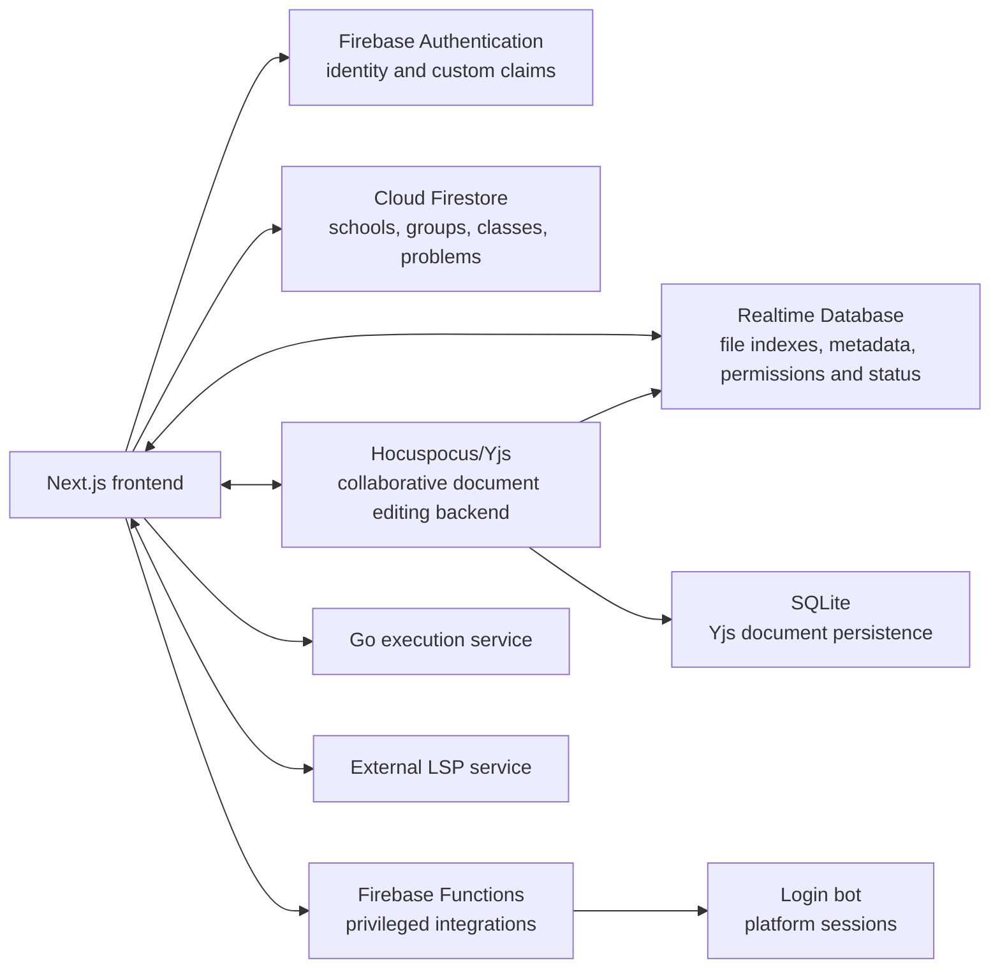

# AlgoPro IDE

AlgoPro IDE is a collaborative online IDE for teaching competitive programming, used by [Algo Pro Club](https://algopro.hu) and [MATFIN Foundation](https://matfin.org). It provides browser-based editing with code completion, real-time collaboration, code execution, integration with common competitive programming problem sets, classroom management, teacher progress views, and Firebase-backed authentication and storage.

The project is based on [USACO IDE](https://github.com/cpinitiative/ide), developed by the [Competitive Programming Initiative](https://joincpi.org/), but has diverged substantially from the original implementation.

A deployment can serve multiple schools. Users may be students, teachers, or administrators. Students belong to groups; teachers create classes containing assigned problems; and teacher permissions are scoped to schools. Administrators can manage all schools, groups, classes, and files.

The main production instance is available at [https://ide.algopro.hu](https://ide.algopro.hu), which follows the `production` branch. Commits on `master` are automatically deployed to the staging instance at [https://dev.ide.algopro.hu](https://dev.ide.algopro.hu).

## Architecture



The front-end is a Next.js Pages Router application. Most authenticated application data is loaded client-side from Firebase, while Next.js API routes handle selected privileged operations.

The editor is powered by [monaco-languageclient](https://github.com/typefox/monaco-languageclient) on desktop and CodeMirror 6 on mobile. Code completion, diagnostics, and hover information come from LSP language servers, which both editors reach through the same connection layer in `src/components/editor/lsp/`. For each language, the server runs either remotely or in the browser:

- Remote: a WebSocket service hosted by a third-party (`NEXT_PUBLIC_LSP_URL`), exposing `clangd` and `pyright`. Its source code and deployment are outside this repository.
- Python in the browser: [BasedPyright](https://docs.basedpyright.com) (`browser-basedpyright`), running in Web Workers.
- C++ in the browser: [clangd](https://clangd.llvm.org/) compiled to WebAssembly ([`@algoproclub/clangd-wasm`](https://github.com/algoproclub/clangd-wasm)), shared by all tabs through a SharedWorker.

Both languages currently default to the remote service. Users can opt-in for each language in their settings, and this preference is stored per device.

Firebase provides:

- Authentication through Google and other OAuth providers. Registration, administrator and teacher roles, and teacher school scopes are represented by custom claims.
- Realtime Database for per-user file indexes and settings, file metadata and permissions, problem-to-file mappings, editor/runtime state, and submission status.
- Firestore for schools, groups, classes, assignments, user profiles, problem metadata, translations, and model solutions. The AlgoPro Firestore database is also used by Discord-related services.
- Cloud Functions and Next.js API routes for privileged operations requiring secrets or Firebase Admin SDK access.
- Storage for test case input/output data.
- Hosting for the co-developed Planets problem bank interface.

The front-end authenticates with Firebase ID tokens. Custom claims determine registration status, roles, and school scopes. Every first-party service contacted by the front-end verifies these tokens; the external LSP service is the exception. Users must be _verified_ by receiving the `registered` custom claim, usually through an invite link, before they can access application resources. Creating an account from the public login page alone does not grant access.

Backend-to-backend requests are authenticated using shared secrets passed with each request.

The Go execution service accepts authenticated browser requests and runs submitted code through [Isolate](https://github.com/ioi/isolate). See [execute/README.md](execute/README.md) for its API, limits, local requirements, and production setup.

Collaborative editing is provided by a Hocuspocus/Yjs service. It verifies Firebase identities and permissions, persists documents in SQLite, and exposes an internal API for copying documents. Realtime Database does not store source-document contents. Its `files/{fileId}` records contain metadata and runtime state rather than source code. See [yjs/README.md](yjs/README.md).

Currently, Yarn v1 is used to manage the web front-end's dependencies; other services use npm.

## Repository layout

```text
pages/                 Next.js Pages Router pages and API routes
src/atoms/             Shared Jotai state
src/components/        Reusable UI and feature components
src/context/           React context providers used by application hooks
src/hooks/             Reusable React data and behavior hooks
src/scripts/           Non-React data-access and imperative helpers
functions/             Firebase Cloud Functions
yjs/                   Hocuspocus/Yjs collaboration service (git submodule)
execute/               Go execution service
login-bot/             External judge login service
tools/                 Local setup, administration, and migrations
```

## Development setup

Local development is done through Docker Compose, which sets up a local instance of all required services and a Firebase emulator. The [tools/setup_local_data.py](tools/setup_local_data.py) script can be used to initialize the baseline database.

For host-side Next.js CLI usage, linting, and build checks, install:

- Node.js 22.0 or later
- the latest Yarn v1 release

Then install the web dependencies on the host:

```bash
yarn install -D
```

To set up and run the full local environment, use Docker Compose:

```bash
git clone --recurse-submodules git@github.com:algoproclub/algopro-ide
cd algopro-ide
docker compose up --build
```

The web front-end is then available at http://localhost:3000.

The following ports are exposed:

| Port | Use                      |
| ---- | ------------------------ |
| 3000 | Web app                  |
| 4000 | Firebase Emulator web UI |
| 1234 | Yjs                      |
| 1235 | Execution service        |
| 8080 | Firestore emulator       |
| 9000 | RTDB emulator            |
| 9099 | Auth emulator            |
| 9199 | Storage emulator         |

Firebase emulator state and the Yjs SQLite database are persisted in Docker volumes, so local state survives ordinary container recreation. Removing the relevant volumes removes this persisted development state.

## Deployment and production setup

TODO: currently undocumented

## Testing

Commits must pass `yarn lint:ci` and `yarn build` to be accepted. The regular `yarn lint` command is available for automatically fixing supported lint and formatting issues. Pre-commit hooks are available through [Husky](https://typicode.github.io/husky/#/) for running the configured checks automatically.

There is no automated test suite. User-visible changes should be verified through the running local application; when that is not possible, document precise manual verification steps.
